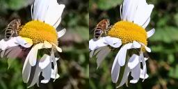
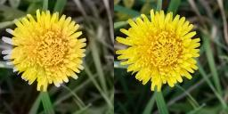
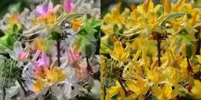

# FlowerColorizer-PyTorch

This is the final project for the course 'CSE 351 - Artificial Intelligence' at Habib University. We implemented the paper ['Colorful Image Colorization'](https://arxiv.org/abs/1603.08511) and made a demo application on iOS to showcase our results. Due to the unavailability of high-performance systems, we used the algorithm to train our model on only images having flowers from the dataset accessible [here](https://drive.google.com/open?id=1WyX-Noc5hz6PF8BPEPdfiglJs3ee9rKY).

## Getting Started

These instructions will get you a copy of the project up and running on your local machine for development and testing purposes.

### Prerequisites

You will need the following hardware and softwares to run the project.

1. A machine running on MacOS.
2. An iOS device running iOS 9 or later.
3. Apple Developer Account.
4. Google Account for development on colab.


### Installing

Clone the repository and run the server through the following commands after install all the dependencies

```
python PythonServer/server.py
```

Now install all CocoaPods dependencies using 

```
cd iOSDemo/
pod install 
```

Now open the [iOS Project](iOSDemo/MLProject.xcworkspace) in XCode and replace your machine's IP in the *requestURL* variable of the [ViewController.swift](iOSDemo/ViewController.swift) class. Then install and run the application on your iOS device.

**Note:** For running the notebook file, download the [file](Notebooks/ImageColorizer.ipynb) and open it in Google Co-Laboratory for features such as mounting gdrive to work.

## Model Results


| **Images that worked** |  **Images that didn't work** |
| :-------------: |:-------------:|
|  |  |
|  |  |
|  |  |
|  |  |
|  |  |

## Authors

See the list of [contributors](https://github.com/your/project/contributors) who participated in this project.

## License

This project is licensed under the MIT License - see the [LICENSE.md](LICENSE.md) file for details

## Acknowledgments

* Dr. Saleha Raza for offering the course and for her support and supervision.
* [Olga Belitskaya](https://www.kaggle.com/olgabelitskaya/the-dataset-of-flower-images) for the flower image dataset.
